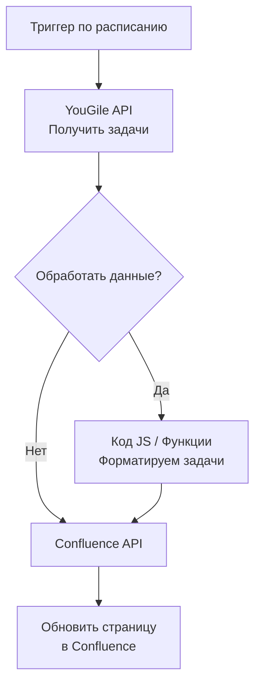

n8n (.io): Это лидер в этой области.

-------------------

Совершенно верно. **n8n** — это один из лидеров в области автоматизации, особенно когда речь идет о решениях, которые можно развернуть самостоятельно (self-hosted). В свете новых ограничений его актуальность для пользователей из РФ и Беларуси резко возросла.

Давайте подробно разберем, почему n8n — отличная альтернатива и как именно его использовать для вашей задачи.

### Почему n8n — идеальный кандидат на замену Zapier?

1.  **Self-Hosted (Развертывание на своем сервере):** Это главное преимущество. Вы устанавливаете и запускаете n8n на своем собственном сервере (в России, Казахстане и т.д.). Сервис работает внутри вашей инфраструктуры, и на него не распространяются ограничения для американских облачных сервисов. Это **санкционно-устойчивое решение**.

2.  **Мощная функциональность:** n8n не уступает Zapier/Make.com по возможностям. Он поддерживает:
    *   **Тысячи готовых коннекторов (Nodes)** для популярных сервисов.
    *   **REST API Node:** Универсальный узел для подключения к любым сервисам, у которых есть API (как раз ваш случай с YouGile и Confluence!).
    *   **Гибкая логика:** Ветвление, циклы, обработка ошибок, преобразование данных (JSON) — все это позволяет создавать очень сложные сценарии (workflows).

3.  **Open-Source:** Исходный код открыт. Это означает прозрачность, безопасность и отсутствие скрытых costs. У него большое и активное сообщество.

4.  **Прозрачная модель ценообразования:** Бесплатная версия (Community Edition) очень функциональна. Платные версии (Enterprise) предлагают дополнительные функции поддержки и управления, но сама базовая автоматизация доступна бесплатно при самостоятельном хостинге.

### Как реализовать интеграцию YouGile -> Confluence через n8n?

Общая схема workflow (сценария) в n8n будет выглядеть так:

**Пошагово:**

1.  **Установите n8n:** Разверните n8n на вашем сервере (например, с помощью Docker, что является рекомендуемым способом). Инструкции очень четкие на официальном сайте.

2.  **Создайте новый Workflow в n8n.**

3.  **Настройте триггер (Trigger):**
    *   Чаще всего используется **"Schedule"** триггер. Он будет запускать ваш сценарий каждые N минут/часов/дней.
    *   Например, можно настроить ежечасную синхронизацию.

4.  **Добавьте узел для работы с YouGile API:**
    *   Используйте узел **"HTTP Request"** (или готовый коннектор для YouGile, если он есть в каталоге n8n).
    *   В настройках узла укажите:
        *   **URL:** API-эндпоинт YouGile для получения карточек (напр., `https://ru.yougile.com/api/v2/cards`).
        *   **Method:** `GET`
        *   **Authentication:** `Bearer Auth`. Вам нужно будет создать и использовать API-ключ из вашего аккаунта YouGile.

5.  **Обработайте данные (опционально, но рекомендуется):**
    *   Данные из YouGile придут в формате JSON. Возможно, вам нужно отфильтровать задачи только из определенного проекта или преобразовать структуру.
    *   Для этого используйте узел **"Code" (JavaScript/Python)** или ноды **"Edit Fields"**. Здесь вы можете написать простой скрипт, который превратит JSON от YouGile в красивый HTML или вики-разметку (Wiki Markup) для Confluence.

6.  **Добавьте узел для работы с Confluence API:**
    *   Снова используйте узел **"HTTP Request"**.
    *   В настройках укажите:
        *   **URL:** API-эндпоинт Confluence для обновления страницы (напр., `https://your-domain.atlassian.net/wiki/rest/api/content/{pageId}`).
        *   **Method:** `PUT` (для обновления существующей страницы).
        *   **Authentication:** `Basic Auth` или `OAuth2`. Используйте логин/пароль (для Basic Auth) или токен приложения (более безопасно) от аккаунта в Confluence.
        *   **Body:** В теле запроса вы передадите отформатированные данные из предыдущего шага, упакованные в JSON, который понимает Confluence API. Это будет обновленная версия содержимого страницы (в формате Storage Format).

7.  **Активируйте workflow и протестируйте.**

### Важные нюансы

*   **Изучение API:** Вашей команде потребуется немного времени, чтобы изучить документацию к API как YouGile, так и Confluence, чтобы правильно формировать запросы.
*   **Безопасность API-ключей:** n8n позволяет безопасно хранить учетные данные и ключи. Не храните их в открытом виде в коде workflow.
*   **Обработка ошибок:** В n8n можно и нужно добавлять узлы для обработки ошибок (например, если API Confluence недоступно, отправить уведомление в Telegram).

### Вывод

**n8n — это не просто альтернатива, а в вашем случае, вероятно, лучшее техническое решение.** Он сочетает мощь и удобство no-code платформы с полной независимостью от санкционных ограничений благодаря возможности self-hosted развертывания.

Вам нужно будет задействовать IT-специалиста (сисадмина/девопса) для первоначальной установки n8n на сервер, а дальше настроить сами workflow сможет даже не-программист, разобравшийся с логикой API.
<!--stackedit_data:
eyJoaXN0b3J5IjpbNDU5NDA0NDMsNzMwOTk4MTE2XX0=
-->